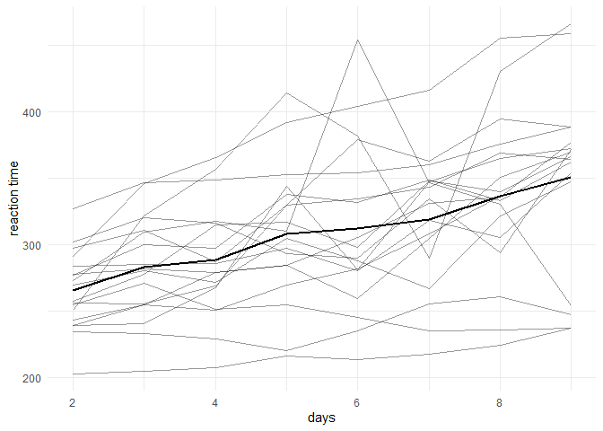
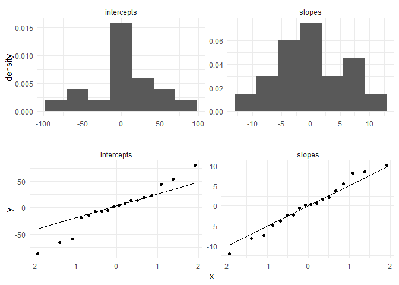
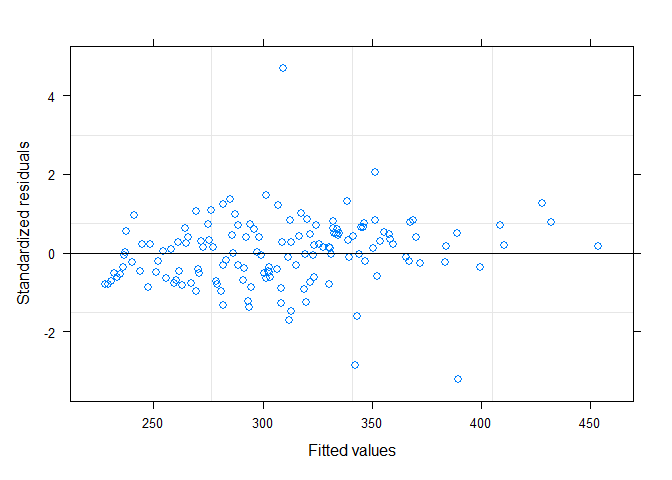
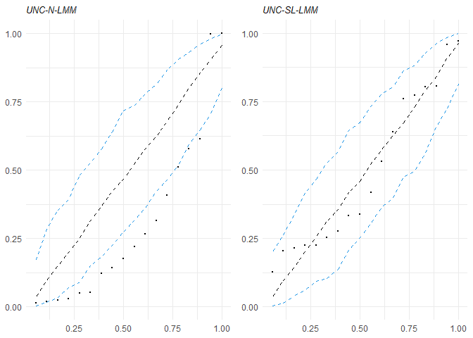
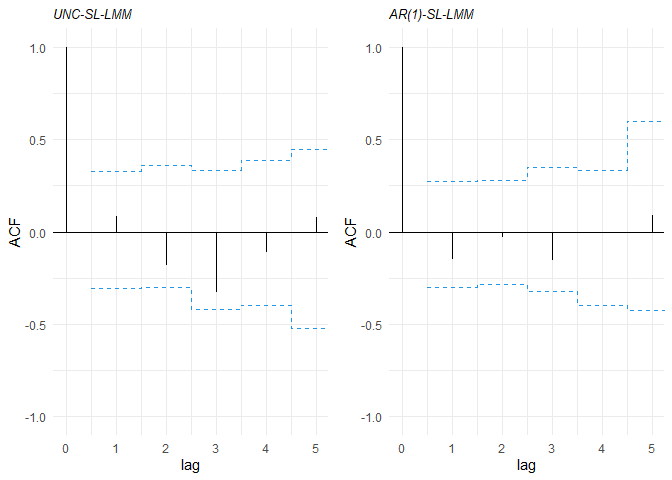
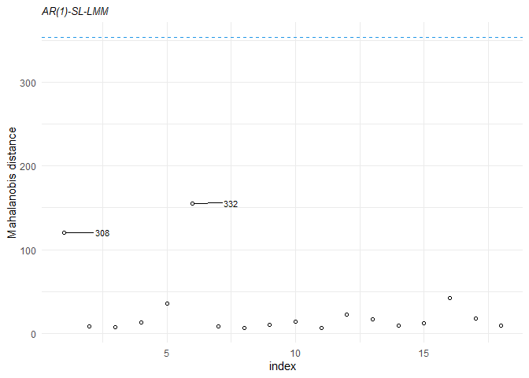
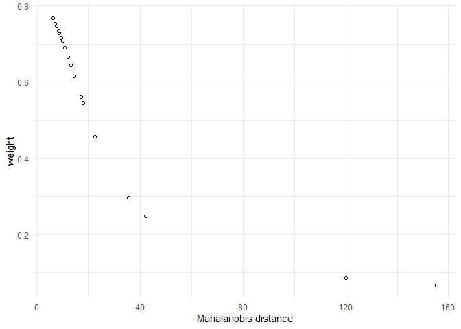
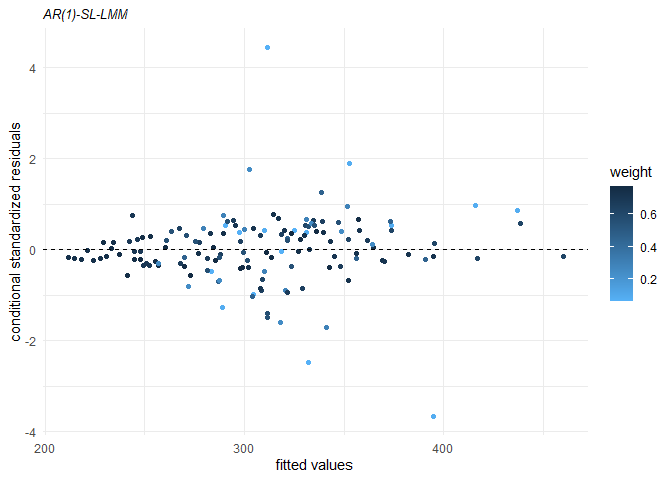
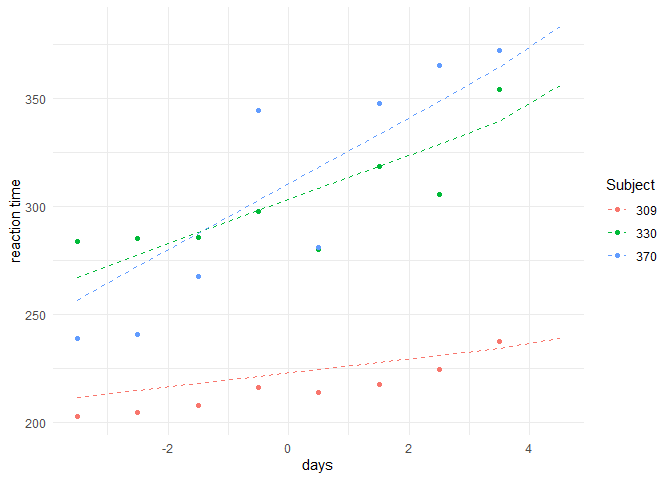
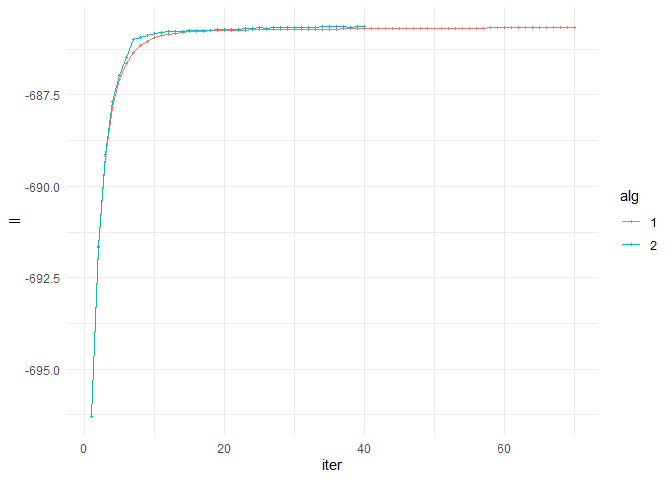

```
## Warning: package 'tidyverse' was built under R version 4.1.3
```

```
## -- Attaching packages --------------------------------------- tidyverse 1.3.1 --
```

```
## v ggplot2 3.3.5     v purrr   0.3.4
## v tibble  3.1.6     v dplyr   1.0.7
## v tidyr   1.1.4     v stringr 1.4.0
## v readr   2.1.1     v forcats 0.5.1
```

```
## -- Conflicts ------------------------------------------ tidyverse_conflicts() --
## x dplyr::filter() masks stats::filter()
## x dplyr::lag()    masks stats::lag()
```

```
## Carregando pacotes exigidos: optimParallel
```

```
## Carregando pacotes exigidos: parallel
```

```
## 
## Attaching package: 'nlme'
```

```
## The following object is masked from 'package:skewlmm':
## 
##     ranef
```

```
## The following object is masked from 'package:dplyr':
## 
##     collapse
```

```
## Carregando pacotes exigidos: Matrix
```

```
## 
## Attaching package: 'Matrix'
```

```
## The following objects are masked from 'package:tidyr':
## 
##     expand, pack, unpack
```

```
## 
## Attaching package: 'lme4'
```

```
## The following object is masked from 'package:nlme':
## 
##     lmList
```

```
## The following object is masked from 'package:skewlmm':
## 
##     ranef
```

```
## 
## Attaching package: 'gridExtra'
```

```
## The following object is masked from 'package:dplyr':
## 
##     combine
```


```r
############################################################################################
# options to install the package

# devtools::install_github("fernandalschumacher/skewlmm")
# install.packages("skewlmm")

############################################################################################
# loading all the packages that we will use

library(tidyverse)
library(skewlmm)
library(nlme)
library(lme4)
library(gridExtra)
library(knitr)
```


```r
############################################################################################
# sleepstudy data

# The average reaction time per day for subjects was evaluated by Gregory et al. (2003) 
# in a sleep deprivation study. On day 0 the subjects had their normal amount of sleep 
# and starting that night they were restricted to 3 hours of sleep per night for 9 days, 
# and the reaction time basead on a series of tests was measured on each day for each subject. 
# The data are avaliable at the R package lme4.

data("sleepstudy",package = "lme4")
sleepstudy %>% glimpse()
```

```
## Rows: 180
## Columns: 3
## $ Reaction <dbl> 249.5600, 258.7047, 250.8006, 321.4398, 356.8519, 414.6901, 3~
## $ Days     <dbl> 0, 1, 2, 3, 4, 5, 6, 7, 8, 9, 0, 1, 2, 3, 4, 5, 6, 7, 8, 9, 0~
## $ Subject  <fct> 308, 308, 308, 308, 308, 308, 308, 308, 308, 308, 309, 309, 3~
```

```r
# centering time in 0 and excluding the first 2 days 
sleepstudy <- subset(sleepstudy,Days>=2) %>% transform(Dayst = Days - 5.5)

ggplot(sleepstudy,aes(x=Days,y=Reaction,group=Subject)) + geom_line(alpha=.4) + 
  stat_summary(aes(group = 1),geom = "line", fun= mean, colour=1,size=1) +
  scale_x_continuous()+ylab("reaction time")+xlab("days")+
  theme_minimal()
```

<!-- -->

```r
############################################################################################
# initial fit: using lme from package nlme (normal distribution)
fitlme <- lme(Reaction~Dayst,data=sleepstudy,random=~Dayst|Subject)
fitlme
```

```
## Linear mixed-effects model fit by REML
##   Data: sleepstudy 
##   Log-restricted-likelihood: -702.0472
##   Fixed: Reaction ~ Dayst 
## (Intercept)       Dayst 
##   307.99142    11.43543 
## 
## Random effects:
##  Formula: ~Dayst | Subject
##  Structure: General positive-definite, Log-Cholesky parametrization
##             StdDev    Corr  
## (Intercept) 42.185397 (Intr)
## Dayst        6.766027 0.692 
## Residual    25.526269       
## 
## Number of Observations: 144
## Number of Groups: 18
```

```r
# plotting the estimated random effects
g1<-nlme::ranef(fitlme) %>% dplyr::rename(`intercepts`=`(Intercept)`,`slopes`=Dayst) %>% 
  pivot_longer(cols = everything()) %>% 
  ggplot(aes(x=value))+ 
  geom_histogram(bins=7,aes(y=..density..)) +
  theme_minimal()+ 
  facet_wrap(~name,scales = "free")+xlab('')+ylab('density') 

g2<-nlme::ranef(fitlme) %>% dplyr::rename(`intercepts`=`(Intercept)`, `slopes`=Dayst) %>% 
  pivot_longer(cols = everything()) %>% 
  ggplot(aes(sample=value))+
  geom_qq() + geom_qq_line()+
  facet_wrap(~name,scales = 'free')+theme_minimal()

gridExtra::grid.arrange(g1,g2,ncol=1)
```

<!-- -->

```r
# checking serial correlation 
ACF(fitlme)
```

```
##   lag         ACF
## 1   0  1.00000000
## 2   1  0.02212213
## 3   2 -0.24387271
## 4   3 -0.41620111
## 5   4 -0.17282884
## 6   5  0.07613035
## 7   6 -0.02442688
## 8   7  0.21382544
```

```r
# using AR(1) with nlme
#fitlmeAR1 <- update(fitlme, correlation = corAR1())
fitlmeAR1 <- update(fitlme, correlation = corAR1(), control = 
                      lmeControl(maxIter = 200, msMaxIter = 200, msMaxEval = 100))

fitlmeAR1
```

```
## Linear mixed-effects model fit by REML
##   Data: sleepstudy 
##   Log-restricted-likelihood: -697.2538
##   Fixed: Reaction ~ Dayst 
## (Intercept)       Dayst 
##   308.01086    11.76067 
## 
## Random effects:
##  Formula: ~Dayst | Subject
##  Structure: General positive-definite, Log-Cholesky parametrization
##             StdDev    Corr  
## (Intercept) 39.178564 (Intr)
## Dayst        5.463379 0.992 
## Residual    30.908430       
## 
## Correlation Structure: AR(1)
##  Formula: ~1 | Subject 
##  Parameter estimate(s):
##       Phi 
## 0.4482821 
## Number of Observations: 144
## Number of Groups: 18
```

```r
anova(fitlmeAR1, fitlme)
```

```
##           Model df      AIC      BIC    logLik   Test  L.Ratio p-value
## fitlmeAR1     1  7 1408.507 1429.198 -697.2538                        
## fitlme        2  6 1416.094 1433.829 -702.0472 1 vs 2 9.586853   0.002
```

```r
plot(fitlmeAR1)
```

<!-- -->

```r
############################################################################################
# using the package skewlmm

fit_norm <- smn.lmm(data = sleepstudy, formFixed = Reaction ~ Dayst,
                    formRandom = ~Dayst, groupVar = "Subject")
```

```
## Iteration  1 
Iteration  2 
Iteration  3 
Iteration  4 
Iteration  5 
Iteration  6 
Iteration  7 
Iteration  8 
Iteration  9 
Iteration  10 
```

```r
fit_norm
```

```
## Linear mixed models with distribution norm and dependency structure UNC 
## Call:
## smn.lmm(data = sleepstudy, formFixed = Reaction ~ Dayst, groupVar = "Subject", 
##     formRandom = ~Dayst)
## 
## Fixed: Reaction ~ Dayst
## Random:
##   Formula: ~Dayst
##   Structure: General positive-definite 
##   Estimated variance (D):
##             (Intercept)     Dayst
## (Intercept)   1676.0032 186.60609
## Dayst          186.6061  42.11465
## 
## Estimated parameters:
##      (Intercept)   Dayst   sigma2 Dsqrt11 Dsqrt12 Dsqrt22
##         307.9914 11.4354 652.1815 40.7356  4.0756  5.0501
## s.e.     10.6104  1.8259  34.8433  7.3654  1.7472  2.0921
## 
## Model selection criteria:
##    logLik      AIC      BIC
##  -706.579 1425.159 1442.977
## 
## Number of observations: 144 
## Number of groups: 18
```

```r
summary(fitlme)$tTable
```

```
##                 Value Std.Error  DF   t-value      p-value
## (Intercept) 307.99142 10.168187 125 30.289708 2.031813e-59
## Dayst        11.43543  1.845312 125  6.197016 7.667999e-09
```

```r
summary(fit_norm)$tableFixed
```

```
##                 Value Std.error CI 95% lower CI 95% upper
## (Intercept) 307.99142 10.610432   287.195355    328.78748
## Dayst        11.43543  1.825868     7.856793     15.01406
```

```r
# changing the distribution

fit_sl <- update(object = fit_norm, distr = "sl")
```

```
## Iteration  1 
Iteration  2 
Iteration  3 
Iteration  4 
Iteration  5 
Iteration  6 
Iteration  7 
Iteration  8 
Iteration  9 
Iteration  10 
Iteration  11 
Iteration  12 
Iteration  13 
Iteration  14 
Iteration  15 
Iteration  16 
Iteration  17 
Iteration  18 
Iteration  19 
Iteration  20 
Iteration  21 
Iteration  22 
Iteration  23 
Iteration  24 
Iteration  25 
Iteration  26 
Iteration  27 
Iteration  28 
Iteration  29 
Iteration  30 
Iteration  31 
Iteration  32 
Iteration  33 
Iteration  34 
Iteration  35 
Iteration  36 
Iteration  37 
Iteration  38 
Iteration  39 
Iteration  40 
```

```r
# assessing the goodness of fit using a Healy-type plot
grid.arrange(healy.plot(fit_norm, calcCI = TRUE),
             healy.plot(fit_sl, calcCI = TRUE), nrow=1)
```

<!-- -->

```r
# using the skewed model
fit_ssl <- smsn.lmm(data = sleepstudy, formFixed = Reaction ~ Dayst,
                    formRandom = ~Dayst, groupVar = "Subject", distr = "ssl")
```

```
## Iteration  1 
Iteration  2 
Iteration  3 
Iteration  4 
Iteration  5 
Iteration  6 
Iteration  7 
Iteration  8 
Iteration  9 
Iteration  10 
Iteration  11 
Iteration  12 
Iteration  13 
Iteration  14 
Iteration  15 
Iteration  16 
Iteration  17 
Iteration  18 
Iteration  19 
Iteration  20 
Iteration  21 
Iteration  22 
Iteration  23 
Iteration  24 
Iteration  25 
Iteration  26 
Iteration  27 
Iteration  28 
Iteration  29 
```

```r
bind_rows(fit_sl$theta, fit_ssl$theta) 
```

```
## # A tibble: 2 x 9
##   `(Intercept)` Dayst sigma2 Dsqrt11 Dsqrt12 Dsqrt22   nu1 lambda1 lambda2
##           <dbl> <dbl>  <dbl>   <dbl>   <dbl>   <dbl> <dbl>   <dbl>   <dbl>
## 1          302.  10.8   139.    32.0    2.89    3.96  1.13  NA      NA    
## 2          306.  10.9   138.    36.3    2.97    4.01  1.15   0.885  -0.228
```

```r
lr.test(fit_sl, fit_ssl)
```

```
## 
## Model selection criteria:
##           logLik      AIC      BIC
## fit_sl  -685.634 1385.269 1406.057
## fit_ssl -685.402 1388.804 1415.532
## 
##     Likelihood-ratio Test
## 
## chi-square statistics =  0.464485 
## df =  2 
## p-value =  0.7927539 
## 
## The null hypothesis that both models represent the 
## data equally well is not rejected at level  0.05
```

```r
# changing the dependence structure 
fit_sl_ar1 <- update(fit_sl, depStruct = "ARp", pAR=1)
```

```
## Iteration  1 
Iteration  2 
Iteration  3 
Iteration  4 
Iteration  5 
Iteration  6 
Iteration  7 
Iteration  8 
Iteration  9 
Iteration  10 
Iteration  11 
Iteration  12 
Iteration  13 
Iteration  14 
Iteration  15 
Iteration  16 
Iteration  17 
Iteration  18 
Iteration  19 
Iteration  20 
Iteration  21 
Iteration  22 
Iteration  23 
```

```r
fit_sl_ar2 <- update(fit_sl, depStruct = "ARp", pAR=2)
```

```
## Iteration  1 
Iteration  2 
Iteration  3 
Iteration  4 
Iteration  5 
Iteration  6 
Iteration  7 
Iteration  8 
Iteration  9 
Iteration  10 
Iteration  11 
Iteration  12 
Iteration  13 
Iteration  14 
Iteration  15 
Iteration  16 
Iteration  17 
Iteration  18 
Iteration  19 
Iteration  20 
Iteration  21 
Iteration  22 
Iteration  23 
Iteration  24 
Iteration  25 
Iteration  26 
Iteration  27 
Iteration  28 
Iteration  29 
Iteration  30 
Iteration  31 
Iteration  32 
Iteration  33 
Iteration  34 
```

```r
# comparing the model criteria
criteria(list(norm = fit_norm ,sl = fit_sl, sl_AR1 = fit_sl_ar1,
              sl_AR2 = fit_sl_ar2)) %>% kable()
```


|       |    logLik| npar|      AIC|      BIC|
|:------|---------:|----:|--------:|--------:|
|norm   | -706.5793|    6| 1425.159| 1442.977|
|sl     | -685.6343|    7| 1385.269| 1406.057|
|sl_AR1 | -682.5440|    8| 1381.088| 1404.846|
|sl_AR2 | -681.1045|    9| 1380.209| 1406.937|

```r
bind_rows(fit_sl_ar1$theta,fit_sl_ar1$std.error)
```

```
## # A tibble: 2 x 8
##   `(Intercept)` Dayst sigma2 phiAR1 Dsqrt11 Dsqrt12 Dsqrt22   nu1
##           <dbl> <dbl>  <dbl>  <dbl>   <dbl>   <dbl>   <dbl> <dbl>
## 1         303.  11.3   187.   0.455   31.3     3.26    2.83  1.22
## 2          10.6  1.66   57.1  0.178    8.62    1.09    1.98 NA
```

```r
bind_rows(fit_sl_ar2$theta,fit_sl_ar2$std.error)
```

```
## # A tibble: 2 x 9
##   `(Intercept)` Dayst sigma2 phiAR1 phiAR2 Dsqrt11 Dsqrt12 Dsqrt22   nu1
##           <dbl> <dbl>  <dbl>  <dbl>  <dbl>   <dbl>   <dbl>   <dbl> <dbl>
## 1         303.  11.1   198.   0.544  0.218    28.0    3.59    1.72  1.17
## 2          10.5  1.75   99.3  0.353  0.219    15.3    3.03   10.5  NA
```

```r
# plotting the residual autocorrelation 
grid.arrange(plot(acfresid(fit_sl, calcCI = TRUE, maxLag = 5)),
             plot(acfresid(fit_sl_ar1, calcCI = TRUE, maxLag = 5)), nrow=1)
```

<!-- -->

```r
# evaluating the fitted AR(1)-SL-LMM
summary(fit_sl_ar1)
```

```
## Linear mixed models with distribution sl and dependency structure ARp 
## Call:
## smn.lmm(data = sleepstudy, formFixed = Reaction ~ Dayst, groupVar = "Subject", 
##     formRandom = ~Dayst, depStruct = "ARp", distr = "sl", pAR = 1)
## 
## Distribution sl with nu = 1.223598 
## 
## Random effects: 
##   Formula: ~Dayst
##   Structure:  
##   Estimated variance (D):
##             (Intercept)     Dayst
## (Intercept)    987.5287 111.21641
## Dayst          111.2164  18.64026
## 
## Fixed effects: Reaction ~ Dayst
## with approximate confidence intervals
##                 Value Std.error CI 95% lower CI 95% upper
## (Intercept) 303.09140 10.563667   282.386993    323.79581
## Dayst        11.26655  1.659266     8.014453     14.51865
## 
## Dependency structure: ARp
##   Estimate(s):
##      sigma2        phi1 
## 187.2645087   0.4553367 
## 
## Model selection criteria:
##    logLik      AIC      BIC
##  -682.544 1381.088 1404.846
## 
## Number of observations: 144 
## Number of groups: 18
```

```r
# Mahalanobis distance
plot(mahalDist(fit_sl_ar1), nlabels = 2)
```

<!-- -->

```r
qplot(mahalDist(fit_sl_ar1), fit_sl_ar1$uhat, #weights resulting from the estimation 
      shape=I(1)) + 
  geom_point(shape=1)+ theme_minimal() +
  ylab("weight") + xlab("Mahalanobis distance")
```

<!-- -->

```r
# residuals plot
plot(fit_sl_ar1,type = "normalized")
```

<!-- -->

```r
############################################################################################
# bootstrap CI
boot_sl_ar1 <- boot_par(fit_sl_ar1, B=14)
boot_ci(boot_sl_ar1) %>% kable(digits=2)
```


|      | (Intercept)| Dayst| sigma2| phiAR1| Dsqrt11| Dsqrt12| Dsqrt22|  nu1|
|:-----|-----------:|-----:|------:|------:|-------:|-------:|-------:|----:|
|2.5%  |      298.67|  9.15| 135.62|   0.23|   22.83|    1.74|    0.92| 0.68|
|97.5% |      326.78| 16.28| 290.78|   0.63|   40.96|    5.65|    4.49| 2.29|

```r
############################################################################################
# prediction
set.seed(6655)
sample_subjects <- sample(unique(sleepstudy$Subject), 3, replace = FALSE)
data_pred <- data.frame(Dayst = 4.5, Subject = sample_subjects)
data_pred <- predict(fit_sl_ar1, newData = data_pred)
names(sleepstudy)
```

```
## [1] "Reaction" "Days"     "Subject"  "Dayst"
```

```r
colnames(data_pred) <- c("Subject", "Dayst", "fitted")
data_pred
```

```
##   Subject Dayst   fitted
## 1     370   4.5 383.1322
## 2     330   4.5 356.1783
## 3     309   4.5 238.7431
```

```r
tibble(select(sleepstudy, Subject, Dayst, Reaction), fitted = fitted(fit_sl_ar1)) %>% 
  bind_rows(data_pred) %>% 
  subset(Subject %in% sample_subjects) %>% 
  ggplot(aes(x=Dayst,y=Reaction,color=Subject)) + 
  geom_point() +
  geom_line(aes(x=Dayst,y=fitted), linetype="dashed") +
  ylab("reaction time")+ xlab("days")+ theme_minimal()
```

```
## Warning: Removed 3 rows containing missing values (geom_point).
```

<!-- -->

```r
############################################################################################
# extra options

# D diagonal
fit_sl_ar1D <- update(fit_sl_ar1, covRandom = "pdDiag")
```

```
## Iteration  1 
Iteration  2 
Iteration  3 
Iteration  4 
Iteration  5 
Iteration  6 
Iteration  7 
Iteration  8 
Iteration  9 
Iteration  10 
Iteration  11 
Iteration  12 
Iteration  13 
Iteration  14 
Iteration  15 
Iteration  16 
Iteration  17 
Iteration  18 
Iteration  19 
Iteration  20 
Iteration  21 
Iteration  22 
Iteration  23 
```

```r
lr.test(fit_sl_ar1, fit_sl_ar1D)
```

```
## 
## Model selection criteria:
##               logLik      AIC      BIC
## fit_sl_ar1  -682.544 1381.088 1404.846
## fit_sl_ar1D -687.046 1388.092 1408.881
## 
##     Likelihood-ratio Test
## 
## chi-square statistics =  9.003924 
## df =  1 
## p-value =  0.002694006 
## 
## The null hypothesis that both models represent the 
## data equally well is rejected at level  0.05
```

```r
# setting lambda2 to 0
fit_ssl1 <- update(fit_ssl, skewind = c(1, 0), 
                   control = lmmControl(algorithm = "EM"))
```

```
## Iteration  1 
Iteration  2 
Iteration  3 
Iteration  4 
Iteration  5 
Iteration  6 
Iteration  7 
Iteration  8 
Iteration  9 
Iteration  10 
Iteration  11 
Iteration  12 
Iteration  13 
Iteration  14 
Iteration  15 
Iteration  16 
Iteration  17 
Iteration  18 
Iteration  19 
Iteration  20 
Iteration  21 
Iteration  22 
Iteration  23 
Iteration  24 
Iteration  25 
Iteration  26 
Iteration  27 
Iteration  28 
Iteration  29 
Iteration  30 
Iteration  31 
Iteration  32 
```

```r
lr.test(fit_ssl1, fit_sl)
```

```
## 
## Model selection criteria:
##            logLik      AIC      BIC
## fit_ssl1 -685.396 1386.793 1410.551
## fit_sl   -685.634 1385.269 1406.057
## 
##     Likelihood-ratio Test
## 
## chi-square statistics =  0.4759163 
## df =  1 
## p-value =  0.4902779 
## 
## The null hypothesis that both models represent the 
## data equally well is not rejected at level  0.05
```

```r
bind_rows(fit_sl$theta, fit_ssl1$theta, fit_ssl$theta)
```

```
## # A tibble: 3 x 9
##   `(Intercept)` Dayst sigma2 Dsqrt11 Dsqrt12 Dsqrt22   nu1 lambda1 lambda2
##           <dbl> <dbl>  <dbl>   <dbl>   <dbl>   <dbl> <dbl>   <dbl>   <dbl>
## 1          302.  10.8   139.    32.0    2.89    3.96  1.13  NA      NA    
## 2          306.  11.2   138.    34.8    3.14    3.98  1.14   0.629  NA    
## 3          306.  10.9   138.    36.3    2.97    4.01  1.15   0.885  -0.228
```

```r
criteria(list(fit_sl, fit_ssl1, fit_ssl)) %>% kable()
```


|    logLik| npar|      AIC|      BIC|
|---------:|----:|--------:|--------:|
| -685.6343|    7| 1385.269| 1406.057|
| -685.3963|    8| 1386.793| 1410.551|
| -685.4020|    9| 1388.804| 1415.532|

```r
# changing the algorithm
fit_slEM <- update(fit_sl, control = lmmControl(algorithm = "EM", showCriterium = TRUE))
```

```
## Iteration  1  of  300  - criterium = 10  - loglik = -696.2839 
Iteration  2  of  300  - criterium = 10  - loglik = -691.6709 
Iteration  3  of  300  - criterium = 0.003578158  - loglik = -689.196 
Iteration  4  of  300  - criterium = 0.001946682  - loglik = -687.8544 
Iteration  5  of  300  - criterium = 0.001111017  - loglik = -687.0902 
Iteration  6  of  300  - criterium = 0.0006691838  - loglik = -686.6304 
Iteration  7  of  300  - criterium = 0.000422071  - loglik = -686.3406 
Iteration  8  of  300  - criterium = 0.000275332  - loglik = -686.1516 
Iteration  9  of  300  - criterium = 0.0001838719  - loglik = -686.0254 
Iteration  10  of  300  - criterium = 0.0001249397  - loglik = -685.9397 
Iteration  11  of  300  - criterium = 8.612254e-05  - loglik = -685.8807 
Iteration  12  of  300  - criterium = 6.01739e-05  - loglik = -685.8394 
Iteration  13  of  300  - criterium = 4.264313e-05  - loglik = -685.8101 
Iteration  14  of  300  - criterium = 3.070222e-05  - loglik = -685.7891 
Iteration  15  of  300  - criterium = 2.251383e-05  - loglik = -685.7736 
Iteration  16  of  300  - criterium = 1.718316e-05  - loglik = -685.7619 
Iteration  17  of  300  - criterium = 1.297007e-05  - loglik = -685.753 
Iteration  18  of  300  - criterium = 1.022264e-05  - loglik = -685.746 
Iteration  19  of  300  - criterium = 7.886277e-06  - loglik = -685.7405 
Iteration  20  of  300  - criterium = 6.891861e-06  - loglik = -685.7358 
Iteration  21  of  300  - criterium = 5.908653e-06  - loglik = -685.7318 
Iteration  22  of  300  - criterium = 5.194145e-06  - loglik = -685.7282 
Iteration  23  of  300  - criterium = 4.66678e-06  - loglik = -685.725 
Iteration  24  of  300  - criterium = 4.27022e-06  - loglik = -685.7221 
Iteration  25  of  300  - criterium = 3.965458e-06  - loglik = -685.7194 
Iteration  26  of  300  - criterium = 3.725423e-06  - loglik = -685.7168 
Iteration  27  of  300  - criterium = 3.531291e-06  - loglik = -685.7144 
Iteration  28  of  300  - criterium = 3.369946e-06  - loglik = -685.7121 
Iteration  29  of  300  - criterium = 3.23223e-06  - loglik = -685.7099 
Iteration  30  of  300  - criterium = 3.111734e-06  - loglik = -685.7077 
Iteration  31  of  300  - criterium = 3.003965e-06  - loglik = -685.7057 
Iteration  32  of  300  - criterium = 2.90576e-06  - loglik = -685.7037 
Iteration  33  of  300  - criterium = 2.814891e-06  - loglik = -685.7017 
Iteration  34  of  300  - criterium = 2.729771e-06  - loglik = -685.6999 
Iteration  35  of  300  - criterium = 2.649289e-06  - loglik = -685.6981 
Iteration  36  of  300  - criterium = 2.572628e-06  - loglik = -685.6963 
Iteration  37  of  300  - criterium = 2.499209e-06  - loglik = -685.6946 
Iteration  38  of  300  - criterium = 2.428605e-06  - loglik = -685.6929 
Iteration  39  of  300  - criterium = 2.360504e-06  - loglik = -685.6913 
Iteration  40  of  300  - criterium = 2.29467e-06  - loglik = -685.6897 
Iteration  41  of  300  - criterium = 2.230923e-06  - loglik = -685.6882 
Iteration  42  of  300  - criterium = 2.169123e-06  - loglik = -685.6867 
Iteration  43  of  300  - criterium = 2.109158e-06  - loglik = -685.6853 
Iteration  44  of  300  - criterium = 2.050936e-06  - loglik = -685.6838 
Iteration  45  of  300  - criterium = 1.994379e-06  - loglik = -685.6825 
Iteration  46  of  300  - criterium = 1.939422e-06  - loglik = -685.6811 
Iteration  47  of  300  - criterium = 1.886006e-06  - loglik = -685.6799 
Iteration  48  of  300  - criterium = 1.834077e-06  - loglik = -685.6786 
Iteration  49  of  300  - criterium = 1.783589e-06  - loglik = -685.6774 
Iteration  50  of  300  - criterium = 1.734495e-06  - loglik = -685.6762 
Iteration  51  of  300  - criterium = 1.686756e-06  - loglik = -685.675 
Iteration  52  of  300  - criterium = 1.64033e-06  - loglik = -685.6739 
Iteration  53  of  300  - criterium = 1.59518e-06  - loglik = -685.6728 
Iteration  54  of  300  - criterium = 1.551271e-06  - loglik = -685.6717 
Iteration  55  of  300  - criterium = 1.508567e-06  - loglik = -685.6707 
Iteration  56  of  300  - criterium = 1.467035e-06  - loglik = -685.6697 
Iteration  57  of  300  - criterium = 1.426642e-06  - loglik = -685.6687 
Iteration  58  of  300  - criterium = 1.387358e-06  - loglik = -685.6678 
Iteration  59  of  300  - criterium = 1.349151e-06  - loglik = -685.6669 
Iteration  60  of  300  - criterium = 1.311993e-06  - loglik = -685.666 
Iteration  61  of  300  - criterium = 1.275855e-06  - loglik = -685.6651 
Iteration  62  of  300  - criterium = 1.240708e-06  - loglik = -685.6642 
Iteration  63  of  300  - criterium = 1.206527e-06  - loglik = -685.6634 
Iteration  64  of  300  - criterium = 1.173283e-06  - loglik = -685.6626 
Iteration  65  of  300  - criterium = 1.140953e-06  - loglik = -685.6618 
Iteration  66  of  300  - criterium = 1.109511e-06  - loglik = -685.6611 
Iteration  67  of  300  - criterium = 1.078933e-06  - loglik = -685.6603 
Iteration  68  of  300  - criterium = 1.049195e-06  - loglik = -685.6596 
Iteration  69  of  300  - criterium = 1.020274e-06  - loglik = -685.6589 
Iteration  70  of  300  - criterium = 9.921484e-07  - loglik = -685.6582 
```

```r
lltrack <- bind_rows(tibble(iter = seq_along(fit_slEM$loglik.track),
                            ll = fit_slEM$loglik.track), 
                     tibble(iter = seq_along(fit_sl$loglik.track), 
                            ll = fit_sl$loglik.track), .id = 'alg')
lltrack %>% ggplot(aes(x = iter, y=ll, color=alg)) + 
  geom_line() + geom_point(size=.8) + theme_minimal()
```

<!-- -->

```r
# not using the parallel computation
fit_slseq <- update(fit_sl, control = lmmControl(parallelnu = FALSE, 
                                                parallelphi = FALSE))
```

```
## Iteration  1 
Iteration  2 
Iteration  3 
Iteration  4 
Iteration  5 
Iteration  6 
Iteration  7 
Iteration  8 
Iteration  9 
Iteration  10 
Iteration  11 
Iteration  12 
Iteration  13 
Iteration  14 
Iteration  15 
Iteration  16 
Iteration  17 
Iteration  18 
Iteration  19 
Iteration  20 
Iteration  21 
Iteration  22 
Iteration  23 
Iteration  24 
Iteration  25 
Iteration  26 
Iteration  27 
Iteration  28 
Iteration  29 
Iteration  30 
Iteration  31 
Iteration  32 
Iteration  33 
Iteration  34 
Iteration  35 
Iteration  36 
Iteration  37 
Iteration  38 
Iteration  39 
Iteration  40 
```

```r
fit_slseq$elapsedTime
```

```
## [1] 23.81242
```

```r
fit_sl$elapsedTime
```

```
## [1] 15.68833
```

```r
# changing initial values
fit_sl2 <- update(fit_sl, control = lmmControl(initialValues = list(nu = 1)))
```

```
## Iteration  1 
Iteration  2 
Iteration  3 
Iteration  4 
Iteration  5 
Iteration  6 
Iteration  7 
Iteration  8 
Iteration  9 
Iteration  10 
Iteration  11 
Iteration  12 
Iteration  13 
Iteration  14 
Iteration  15 
Iteration  16 
Iteration  17 
Iteration  18 
Iteration  19 
Iteration  20 
Iteration  21 
Iteration  22 
Iteration  23 
Iteration  24 
Iteration  25 
Iteration  26 
Iteration  27 
Iteration  28 
Iteration  29 
Iteration  30 
Iteration  31 
Iteration  32 
Iteration  33 
Iteration  34 
Iteration  35 
Iteration  36 
Iteration  37 
```

