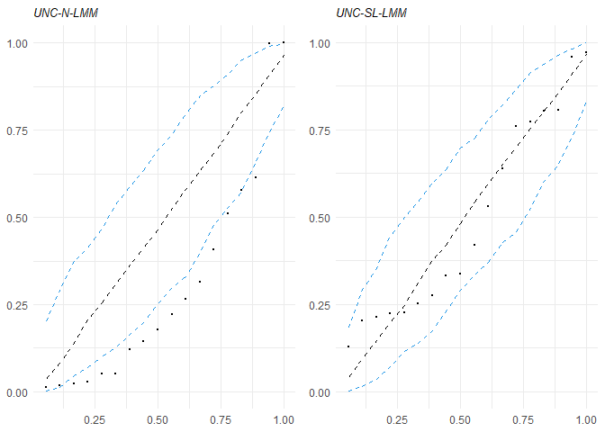
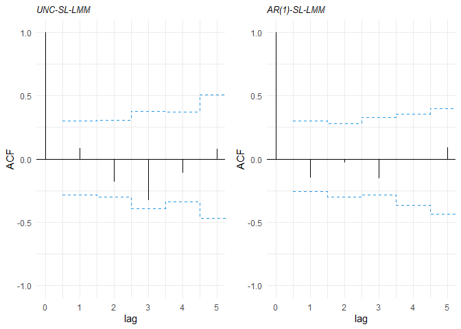

Tutorial: Modeling Longitudinal Data using Robust Mixed Models in R

Authors: Fernanda Lang Schumacher, Larissa Avila Matos, and Victor Hugo Lachos


```r
############################################################################################
# options to install the package

# devtools::install_github("fernandalschumacher/skewlmm")
# install.packages("skewlmm")

############################################################################################
# loading all the packages that we will use

library(tidyverse)
library(skewlmm)
library(nlme)
library(lme4)
library(gridExtra)
library(knitr)
```


```r
############################################################################################
# sleepstudy data

# The average reaction time per day for subjects was evaluated by Gregory et al. (2003)
# in a sleep deprivation study. On day 0 the subjects had their normal amount of sleep
# and starting that night they were restricted to 3 hours of sleep per night for 9 days,
# and the reaction time basead on a series of tests was measured on each day for each subject.
# The data are avaliable at the R package lme4.

data("sleepstudy",package = "lme4")
sleepstudy %>% glimpse()
```

```
## Rows: 180
## Columns: 3
## $ Reaction <dbl> 249.5600, 258.7047, 250.8006, 321.4398, 356.8519, 414.6901, 3~
## $ Days     <dbl> 0, 1, 2, 3, 4, 5, 6, 7, 8, 9, 0, 1, 2, 3, 4, 5, 6, 7, 8, 9, 0~
## $ Subject  <fct> 308, 308, 308, 308, 308, 308, 308, 308, 308, 308, 309, 309, 3~
```

```r
# centering time in 0 and excluding the first 2 days
sleepstudy <- subset(sleepstudy,Days>=2) %>% transform(Dayst = Days - 5.5)

ggplot(sleepstudy,aes(x=Days,y=Reaction,group=Subject)) + geom_line(alpha=.4) +
  stat_summary(aes(group = 1),geom = "line", fun= mean, colour=1,size=1) +
  scale_x_continuous()+ylab("reaction time")+xlab("days")+
  theme_minimal()
```

<!-- -->

```r
############################################################################################
# initial fit: using lme from package nlme (normal distribution)
fitlme <- lme(Reaction~Dayst,data=sleepstudy,random=~Dayst|Subject)
fitlme
```

```
## Linear mixed-effects model fit by REML
##   Data: sleepstudy 
##   Log-restricted-likelihood: -702.0472
##   Fixed: Reaction ~ Dayst 
## (Intercept)       Dayst 
##   307.99142    11.43543 
## 
## Random effects:
##  Formula: ~Dayst | Subject
##  Structure: General positive-definite, Log-Cholesky parametrization
##             StdDev    Corr  
## (Intercept) 42.185397 (Intr)
## Dayst        6.766027 0.692 
## Residual    25.526269       
## 
## Number of Observations: 144
## Number of Groups: 18
```

```r
# plotting the estimated random effects
g1<-nlme::ranef(fitlme) %>% dplyr::rename(`intercepts`=`(Intercept)`,`slopes`=Dayst) %>%
  pivot_longer(cols = everything()) %>%
  ggplot(aes(x=value))+
  geom_histogram(bins=7,aes(y=..density..)) +
  theme_minimal()+
  facet_wrap(~name,scales = "free")+xlab('')+ylab('density')

g2<-nlme::ranef(fitlme) %>% dplyr::rename(`intercepts`=`(Intercept)`, `slopes`=Dayst) %>%
  pivot_longer(cols = everything()) %>%
  ggplot(aes(sample=value))+
  geom_qq() + geom_qq_line()+
  facet_wrap(~name,scales = 'free')+theme_minimal()

gridExtra::grid.arrange(g1,g2,ncol=1)
```

<!-- -->

```r
# checking serial correlation
ACF(fitlme)
```

```
##   lag         ACF
## 1   0  1.00000000
## 2   1  0.02212213
## 3   2 -0.24387271
## 4   3 -0.41620111
## 5   4 -0.17282884
## 6   5  0.07613035
## 7   6 -0.02442688
## 8   7  0.21382544
```

```r
# using AR(1) with nlme
#fitlmeAR1 <- update(fitlme, correlation = corAR1())
fitlmeAR1 <- update(fitlme, correlation = corAR1(), control =
                      lmeControl(maxIter = 200, msMaxIter = 200, msMaxEval = 100))

fitlmeAR1
```

```
## Linear mixed-effects model fit by REML
##   Data: sleepstudy 
##   Log-restricted-likelihood: -697.2538
##   Fixed: Reaction ~ Dayst 
## (Intercept)       Dayst 
##   308.01086    11.76067 
## 
## Random effects:
##  Formula: ~Dayst | Subject
##  Structure: General positive-definite, Log-Cholesky parametrization
##             StdDev    Corr  
## (Intercept) 39.178564 (Intr)
## Dayst        5.463379 0.992 
## Residual    30.908430       
## 
## Correlation Structure: AR(1)
##  Formula: ~1 | Subject 
##  Parameter estimate(s):
##       Phi 
## 0.4482821 
## Number of Observations: 144
## Number of Groups: 18
```

```r
anova(fitlmeAR1, fitlme)
```

```
##           Model df      AIC      BIC    logLik   Test  L.Ratio p-value
## fitlmeAR1     1  7 1408.507 1429.198 -697.2538                        
## fitlme        2  6 1416.094 1433.829 -702.0472 1 vs 2 9.586853   0.002
```

```r
plot(fitlmeAR1)
```

<!-- -->

```r
############################################################################################
# using the package skewlmm

fit_norm <- smn.lmm(data = sleepstudy, formFixed = Reaction ~ Dayst,
                    formRandom = ~Dayst, groupVar = "Subject",
                    control = lmmControl(quiet=TRUE))
fit_norm
```

```
## Linear mixed models with distribution norm and dependency structure UNC 
## Call:
## smn.lmm(data = sleepstudy, formFixed = Reaction ~ Dayst, groupVar = "Subject", 
##     formRandom = ~Dayst, control = lmmControl(quiet = TRUE))
## 
## Fixed: Reaction ~ Dayst
## Random:
##   Formula: ~Dayst
##   Structure: General positive-definite 
##   Estimated variance (D):
##             (Intercept)     Dayst
## (Intercept)   1676.0032 186.60609
## Dayst          186.6061  42.11465
## 
## Estimated parameters:
##      (Intercept)   Dayst   sigma2 Dsqrt11 Dsqrt12 Dsqrt22
##         307.9914 11.4354 652.1815 40.7356  4.0756  5.0501
## s.e.     10.6104  1.8259  34.8433  7.3654  1.7472  2.0921
## 
## Model selection criteria:
##    logLik      AIC      BIC
##  -706.579 1425.159 1442.977
## 
## Number of observations: 144 
## Number of groups: 18
```

```r
summary(fitlme)$tTable
```

```
##                 Value Std.Error  DF   t-value      p-value
## (Intercept) 307.99142 10.168187 125 30.289708 2.031813e-59
## Dayst        11.43543  1.845312 125  6.197016 7.667999e-09
```

```r
summary(fit_norm)$tableFixed
```

```
##                 Value Std.error CI 95% lower CI 95% upper
## (Intercept) 307.99142 10.610432   287.195355    328.78748
## Dayst        11.43543  1.825868     7.856793     15.01406
```

```r
# changing the distribution

fit_sl <- update(object = fit_norm, distr = "sl")

# assessing the goodness of fit using a Healy-type plot
grid.arrange(healy.plot(fit_norm, calcCI = TRUE),
             healy.plot(fit_sl, calcCI = TRUE), nrow=1)
```

<!-- -->

```r
# using the skewed model
fit_ssl <- smsn.lmm(data = sleepstudy, formFixed = Reaction ~ Dayst,
                    formRandom = ~Dayst, groupVar = "Subject", distr = "ssl",
                    control = lmmControl(quiet=TRUE))

bind_rows(fit_sl$theta, fit_ssl$theta)
```

```
## # A tibble: 2 x 9
##   `(Intercept)` Dayst sigma2 Dsqrt11 Dsqrt12 Dsqrt22   nu1 lambda1 lambda2
##           <dbl> <dbl>  <dbl>   <dbl>   <dbl>   <dbl> <dbl>   <dbl>   <dbl>
## 1          302.  10.8   139.    32.0    2.89    3.96  1.13  NA      NA    
## 2          306.  10.9   138.    36.3    2.97    4.01  1.15   0.885  -0.228
```

```r
lr.test(fit_sl, fit_ssl)
```

```
## 
## Model selection criteria:
##           logLik      AIC      BIC
## fit_sl  -685.634 1385.269 1406.057
## fit_ssl -685.402 1388.804 1415.532
## 
##     Likelihood-ratio Test
## 
## chi-square statistics =  0.464485 
## df =  2 
## p-value =  0.7927539 
## 
## The null hypothesis that both models represent the 
## data equally well is not rejected at level  0.05
```

```r
# changing the dependence structure
fit_sl_ar1 <- update(fit_sl, depStruct = "ARp", pAR=1)
fit_sl_ar2 <- update(fit_sl, depStruct = "ARp", pAR=2)

# comparing the model criteria
criteria(list(norm = fit_norm ,sl = fit_sl, sl_AR1 = fit_sl_ar1,
              sl_AR2 = fit_sl_ar2)) %>% kable()
```


|       |    logLik| npar|      AIC|      BIC|
|:------|---------:|----:|--------:|--------:|
|norm   | -706.5793|    6| 1425.159| 1442.977|
|sl     | -685.6343|    7| 1385.269| 1406.057|
|sl_AR1 | -682.5440|    8| 1381.088| 1404.846|
|sl_AR2 | -681.1045|    9| 1380.209| 1406.937|

```r
bind_rows(fit_sl_ar1$theta,fit_sl_ar1$std.error)
```

```
## # A tibble: 2 x 8
##   `(Intercept)` Dayst sigma2 phiAR1 Dsqrt11 Dsqrt12 Dsqrt22   nu1
##           <dbl> <dbl>  <dbl>  <dbl>   <dbl>   <dbl>   <dbl> <dbl>
## 1         303.  11.3   187.   0.455   31.3     3.26    2.83  1.22
## 2          10.6  1.66   57.1  0.178    8.62    1.09    1.98 NA
```

```r
bind_rows(fit_sl_ar2$theta,fit_sl_ar2$std.error)
```

```
## # A tibble: 2 x 9
##   `(Intercept)` Dayst sigma2 phiAR1 phiAR2 Dsqrt11 Dsqrt12 Dsqrt22   nu1
##           <dbl> <dbl>  <dbl>  <dbl>  <dbl>   <dbl>   <dbl>   <dbl> <dbl>
## 1         303.  11.1   198.   0.544  0.218    28.0    3.59    1.72  1.17
## 2          10.5  1.75   99.3  0.353  0.219    15.3    3.03   10.5  NA
```

```r
# plotting the residual autocorrelation
grid.arrange(plot(acfresid(fit_sl, calcCI = TRUE, maxLag = 5)),
             plot(acfresid(fit_sl_ar1, calcCI = TRUE, maxLag = 5)), nrow=1)
```

<!-- -->

```r
# evaluating the fitted AR(1)-SL-LMM
summary(fit_sl_ar1)
```

```
## Linear mixed models with distribution sl and dependency structure ARp 
## Call:
## smn.lmm(data = sleepstudy, formFixed = Reaction ~ Dayst, groupVar = "Subject", 
##     formRandom = ~Dayst, depStruct = "ARp", distr = "sl", pAR = 1, 
##     control = lmmControl(quiet = TRUE))
## 
## Distribution sl with nu = 1.223598 
## 
## Random effects: 
##   Formula: ~Dayst
##   Structure:  
##   Estimated variance (D):
##             (Intercept)     Dayst
## (Intercept)    987.5287 111.21641
## Dayst          111.2164  18.64026
## 
## Fixed effects: Reaction ~ Dayst
## with approximate confidence intervals
##                 Value Std.error CI 95% lower CI 95% upper
## (Intercept) 303.09140 10.563667   282.386993    323.79581
## Dayst        11.26655  1.659266     8.014453     14.51865
## 
## Dependency structure: ARp
##   Estimate(s):
##      sigma2        phi1 
## 187.2645087   0.4553367 
## 
## Model selection criteria:
##    logLik      AIC      BIC
##  -682.544 1381.088 1404.846
## 
## Number of observations: 144 
## Number of groups: 18
```

```r
# Mahalanobis distance
plot(mahalDist(fit_sl_ar1), nlabels = 2)
```

<!-- -->

```r
qplot(mahalDist(fit_sl_ar1), fit_sl_ar1$uhat, #weights resulting from the estimation
      shape=I(1)) +
  geom_point(shape=1)+ theme_minimal() +
  ylab("weight") + xlab("Mahalanobis distance")
```

<!-- -->

```r
# residuals plot
plot(fit_sl_ar1,type = "normalized")
```

<!-- -->

```r
############################################################################################
# bootstrap CI
boot_sl_ar1 <- boot_par(fit_sl_ar1, B=14)
boot_ci(boot_sl_ar1) %>% kable(digits=2)
```


|      | (Intercept)| Dayst| sigma2| phiAR1| Dsqrt11| Dsqrt12| Dsqrt22|  nu1|
|:-----|-----------:|-----:|------:|------:|-------:|-------:|-------:|----:|
|2.5%  |      298.67|  9.15| 135.62|   0.23|   22.83|    1.74|    0.92| 0.68|
|97.5% |      326.78| 16.28| 290.78|   0.63|   40.96|    5.65|    4.49| 2.29|

```r
############################################################################################
# prediction
set.seed(6655)
sample_subjects <- sample(unique(sleepstudy$Subject), 3, replace = FALSE)
data_pred <- data.frame(Dayst = 4.5, Subject = sample_subjects)
data_pred <- predict(fit_sl_ar1, newData = data_pred)
names(sleepstudy)
```

```
## [1] "Reaction" "Days"     "Subject"  "Dayst"
```

```r
colnames(data_pred) <- c("Subject", "Dayst", "fitted")
data_pred
```

```
##   Subject Dayst   fitted
## 1     370   4.5 383.1322
## 2     330   4.5 356.1783
## 3     309   4.5 238.7431
```

```r
tibble(select(sleepstudy, Subject, Dayst, Reaction), fitted = fitted(fit_sl_ar1)) %>%
  bind_rows(data_pred) %>%
  subset(Subject %in% sample_subjects) %>%
  ggplot(aes(x=Dayst,y=Reaction,color=Subject)) +
  geom_point() +
  geom_line(aes(x=Dayst,y=fitted), linetype="dashed") +
  ylab("reaction time")+ xlab("days")+ theme_minimal()
```

<!-- -->

```r
############################################################################################
# extra options

# D diagonal
fit_sl_ar1D <- update(fit_sl_ar1, covRandom = "pdDiag")
lr.test(fit_sl_ar1, fit_sl_ar1D)
```

```
## 
## Model selection criteria:
##               logLik      AIC      BIC
## fit_sl_ar1  -682.544 1381.088 1404.846
## fit_sl_ar1D -687.046 1388.092 1408.881
## 
##     Likelihood-ratio Test
## 
## chi-square statistics =  9.003924 
## df =  1 
## p-value =  0.002694006 
## 
## The null hypothesis that both models represent the 
## data equally well is rejected at level  0.05
```

```r
# setting lambda2 to 0
fit_ssl1 <- update(fit_ssl, skewind = c(1, 0),
                   control = lmmControl(algorithm = "EM"))
```

```
## Iteration  1 
Iteration  2 
Iteration  3 
Iteration  4 
Iteration  5 
Iteration  6 
Iteration  7 
Iteration  8 
Iteration  9 
Iteration  10 
Iteration  11 
Iteration  12 
Iteration  13 
Iteration  14 
Iteration  15 
Iteration  16 
Iteration  17 
Iteration  18 
Iteration  19 
Iteration  20 
Iteration  21 
Iteration  22 
Iteration  23 
Iteration  24 
Iteration  25 
Iteration  26 
Iteration  27 
Iteration  28 
Iteration  29 
Iteration  30 
Iteration  31 
Iteration  32 
```

```r
lr.test(fit_ssl1, fit_sl)
```

```
## 
## Model selection criteria:
##            logLik      AIC      BIC
## fit_ssl1 -685.396 1386.793 1410.551
## fit_sl   -685.634 1385.269 1406.057
## 
##     Likelihood-ratio Test
## 
## chi-square statistics =  0.4759163 
## df =  1 
## p-value =  0.4902779 
## 
## The null hypothesis that both models represent the 
## data equally well is not rejected at level  0.05
```

```r
bind_rows(fit_sl$theta, fit_ssl1$theta, fit_ssl$theta)
```

```
## # A tibble: 3 x 9
##   `(Intercept)` Dayst sigma2 Dsqrt11 Dsqrt12 Dsqrt22   nu1 lambda1 lambda2
##           <dbl> <dbl>  <dbl>   <dbl>   <dbl>   <dbl> <dbl>   <dbl>   <dbl>
## 1          302.  10.8   139.    32.0    2.89    3.96  1.13  NA      NA    
## 2          306.  11.2   138.    34.8    3.14    3.98  1.14   0.629  NA    
## 3          306.  10.9   138.    36.3    2.97    4.01  1.15   0.885  -0.228
```

```r
criteria(list(fit_sl, fit_ssl1, fit_ssl)) %>% kable()
```


|    logLik| npar|      AIC|      BIC|
|---------:|----:|--------:|--------:|
| -685.6343|    7| 1385.269| 1406.057|
| -685.3963|    8| 1386.793| 1410.551|
| -685.4020|    9| 1388.804| 1415.532|

```r
# changing the algorithm
fit_slEM <- update(fit_sl, control = lmmControl(algorithm = "EM", quiet = TRUE))

lltrack <- bind_rows(tibble(iter = seq_along(fit_slEM$loglik.track),
                            ll = fit_slEM$loglik.track),
                     tibble(iter = seq_along(fit_sl$loglik.track),
                            ll = fit_sl$loglik.track), .id = 'alg')
lltrack %>% ggplot(aes(x = iter, y=ll, color=alg)) +
  geom_line() + geom_point(size=.8) + theme_minimal()
```

<!-- -->

```r
# not using the parallel computation
fit_slseq <- update(fit_sl, control = lmmControl(parallelnu = FALSE,
                                                parallelphi = FALSE,
                                                quiet = TRUE))
fit_slseq$elapsedTime
```

```
## [1] 14.94417
```

```r
fit_sl$elapsedTime
```

```
## [1] 15.63276
```

```r
# changing initial values
fit_sl2 <- update(fit_sl, control = lmmControl(initialValues = list(nu = 1),
                                               quiet = TRUE))
```

